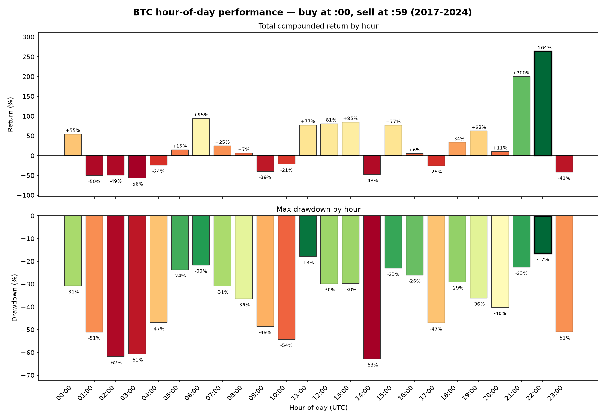

# Bitcoin hour-of-day backtesting engine

Loads Binance BTC/USDT 1-second kline data (2017-08-17 → 2024-08-27) into Postgres and  
uses dbt to answer, for a strategy that buys at the top of an hour and sells at the  
bottom of it, every day in range:

1. Which hour of the day had the biggest returns?
2. Which hour of the day had the lowest maximum losses?

## Running it

```bash
./run.sh
```

Looks for `half1_BTCUSDT_1s.csv` / `half2_BTCUSDT_1s.csv` in the repo root — override  
with `DATA_DIR=/path/to/csvs ./run.sh`. Uses Docker if it's available (spins up Postgres  
16), otherwise connects to whatever Postgres is already running (override with `PGHOST`,  
`PGPORT`, `PGUSER`, `PGPASSWORD`, `PGDATABASE`). Uses `dbt` if it's already on `PATH`,  
otherwise sets up its own virtualenv with `python3`. Safe to re-run.

## Result

**Hour 22:00–22:59 UTC wins both questions** — the highest compounded return  
(**+263.7%**) *and* the shallowest worst-case drawdown (**-16.5%**, the smallest  
magnitude of all 24 hours) — by a real margin over the runner-up on each metric (21:00 on  
return, 11:00 on drawdown).



`./run.sh` regenerates this chart every run (final step, `matplotlib`) — the image above  
is checked in as a snapshot of it, since the source data is fixed.

## Project layout

```
run.sh                    orchestrates the whole pipeline (see above)
docker-compose.yml        Postgres 16, ephemeral (no volume — a fresh container per run)
profiles/profiles.yml     repo-local dbt profile (via DBT_PROFILES_DIR); never touches ~/.dbt
requirements.txt          dbt-postgres
alpaca_assignment/        the dbt project
  models/staging/         stg_btc_ticks — typed, deduplicated, 1:1 with raw source
  models/intermediate/    the pivot → return → compounding steps, one model each
  models/marts/           mart_daily_hourly_performance — the reusable fact table
  analyses/                the two final queries that actually answer the prompt
  tests/                  custom data-quality tests (grain checks, row-count checks)
```

## Design decisions

**"Lowest maximum losses" → max drawdown of the compounded equity curve.** For each  
hour-of-day, build the running compounded equity curve across all days  
(`equity_t = equity_{t-1} * (1 + r_t)`), then take the worst peak-to-trough decline over  
the whole series. Compounding, not just the single worst daily return, because the  
prompt itself describes reinvestment — and it's the standard backtesting risk metric.

**Loading strategy: pre-filter to `:00`/`:59` seconds before loading, not the full 221M**  
**rows.** The strategy can only ever use two rows per hour per day, so `run.sh` filters to  
those (~123K rows) before touching Postgres — keeps the graded script itself to seconds  
instead of tens of minutes. The production-scale alternative is to load the full raw  
data untouched and do this filtering as the first dbt staging step instead — slower to  
load once, but means the loader never needs to change again if the strategy's logic does.  
This submission optimizes for the grader's time instead.

## Data quality findings

Two real issues turned up by actually loading and testing the data, not just inspecting  
it:

- **15 timestamps** have 9 byte-identical duplicate rows each, right before a repeating  
"restart" pattern in the source seconds. `stg_btc_ticks` dedupes these losslessly.
- **30 hours** (out of ~58,600 in range) are missing either their `:00` or `:59` tick  
entirely — a true single-row gap, not just a zero-volume carry-forward.  
`int_hourly_prices` drops these hours rather than computing a return off a missing  
price.

Both are covered by dbt tests, so a future data refresh that reintroduces either issue  
(or a new one shaped like it) fails the build instead of silently shipping a wrong  
answer.

## Model design

Standard staging → intermediate → marts layering, each layer with one job. The one  
choice worth calling out here: `mart_daily_hourly_performance` is **not** aggregated up  
to one row per hour-of-day — it stays at `(date, hour)` grain (~61,450 rows), and the  
hour-of-day rollup happens in `analyses/`, not in the mart. Two reasons:

1. **No mart resolves the prompt's questions directly.** `analyses/` — dbt's mechanism
  for a versioned, compilable query that creates no relation — holds the two rollups;  
   the mart itself stays a general-purpose fact table.
2. **Keeping the daily grain means other questions don't need a new model.** Weekday vs.
  weekend performance by hour, a trend for one specific hour over time, the worst single  
   day for a given hour — all just a different query against the same table. For  
   example, hour 22's performance restricted to weekdays only:
   ```sql
   select
       hour,
       (array_agg(equity order by date desc))[1] - 1 as total_compounded_return,
       min(drawdown) as max_drawdown
   from alpaca.mart_daily_hourly_performance
   where hour = 22
     and extract(dow from date) between 1 and 5  -- Mon-Fri
   group by hour;
   ```
   Restricting any of the analyses to a specific day-of-week, or re-targeting a specific  
   hour instead of ranking all 24, is the same pattern: add a `where` clause to the query  
   in `analyses/`, or write a new one alongside it — never a new model.
